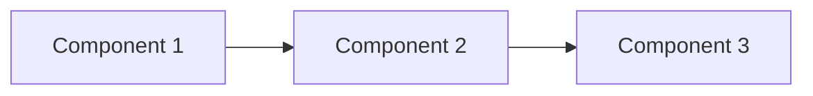

# Module Project: [PROJECT_TITLE]

**Objective**: [What you'll build - 1 sentence]

**Difficulty**: [Beginner/Intermediate/Advanced]

**Estimated Time**: [X] hours

---

## Project Overview

[2-3 paragraphs describing the project, its relevance to Physical AI, and what skills it demonstrates]

## Learning Outcomes

Upon completing this project, you will have:
- [Skill/knowledge 1]
- [Skill/knowledge 2]
- [Skill/knowledge 3]

## Requirements

### Functional Requirements
- [ ] [Requirement 1]
- [ ] [Requirement 2]
- [ ] [Requirement 3]

### Technical Requirements
- [ ] Code must pass `pylint` with score ≥8.0
- [ ] All ROS 2 nodes must have proper error handling
- [ ] URDF model must load in Gazebo/RViz without errors

## Architecture

[Diagram showing system components and data flow]



## Implementation Guide

### Phase 1: Setup

1. Create ROS 2 package structure
2. Set up dependencies
3. Create initial launch files

### Phase 2: Core Functionality

[Step-by-step implementation guidance]

### Phase 3: Integration & Testing

[How to integrate components and test]

## Starter Code

```python
#!/usr/bin/env python3
"""
[Project Name] - Starter Code
Module: [Module Number]
"""

import rclpy
from rclpy.node import Node

class ProjectNode(Node):
    def __init__(self):
        super().__init__('project_node')
        # TODO: Initialize your node

def main():
    rclpy.init()
    node = ProjectNode()
    rclpy.spin(node)
    rclpy.shutdown()

if __name__ == '__main__':
    main()
```

## Testing Criteria

Your project passes if:
- [ ] All functional requirements met
- [ ] Code passes linting (≥8.0/10)
- [ ] System runs without errors for 5+ minutes
- [ ] [Specific test criterion]

## Evaluation Rubric

| Criterion | Weight | Description |
|-----------|--------|-------------|
| Functionality | 40% | All requirements implemented correctly |
| Code Quality | 20% | Clean, well-documented code |
| ROS 2 Best Practices | 20% | Proper use of nodes, topics, services |
| Error Handling | 10% | Graceful handling of edge cases |
| Documentation | 10% | Clear README and code comments |

## Submission

1. Commit your code to your repository
2. Create a video demo (2-3 minutes) showing:
   - System startup
   - Core functionality
   - Edge case handling
3. Write a brief report (1-2 pages) documenting:
   - Design decisions
   - Challenges faced
   - Lessons learned

## Extension Ideas

Want to go further? Try these challenges:
- [Extension 1]
- [Extension 2]
- [Extension 3]

## Example Solution

:::caution Spoiler Alert!
Try completing the project on your own first before viewing the solution.
:::

[Link to example solution repository]

## Next Steps

After completing this project, you're ready for [Next Module/Chapter].
