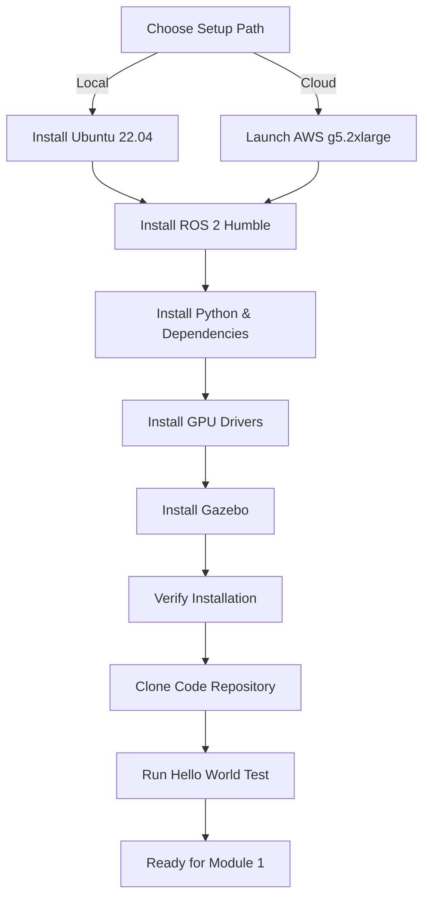

# Getting Started

**Before you write your first robot controller, you need the right tools.** This section guides you through setting up a complete Physical AI development environment, from installing Ubuntu 22.04 to verifying your GPU works with NVIDIA Isaac Sim.

## What You'll Set Up

By the end of this section, you'll have:

1. **Ubuntu 22.04 LTS** (required for ROS 2 Humble compatibility)
2. **ROS 2 Humble** (the robotics middleware we'll use throughout the book)
3. **Python 3.10+** with robotics libraries (NumPy, OpenCV, PyTorch)
4. **NVIDIA GPU drivers** (optional but recommended for Isaac Sim in Module 3)
5. **Gazebo Classic** (physics simulator for Module 2)
6. **Development tools** (VS Code, Git, colcon build system)

**Total time**: 1-2 hours (mostly waiting for downloads and installs)

## Two Setup Paths

### Path 1: Local Installation (Recommended)

**Best for**:
- You have a Linux laptop or desktop
- You want offline access and full control
- You plan to use physical robots later (easier hardware integration)

**Minimum requirements**:
- **OS**: Ubuntu 22.04 LTS (fresh install or dual-boot)
- **RAM**: 8 GB (16 GB recommended for Isaac Sim)
- **Storage**: 50 GB free space
- **GPU**: NVIDIA GTX 1660 or better (optional; CPU-only works for Modules 1-2)

**Advantages**:
- No recurring costs
- Full system control
- Works offline
- Easier to connect real robots later

**Disadvantages**:
- Requires Windows → Ubuntu migration if you're not on Linux
- GPU requirements for Module 3 (Isaac Sim)

### Path 2: Cloud-Based Setup (AWS EC2)

**Best for**:
- You're on Windows/macOS and don't want to dual-boot
- You need a powerful GPU but don't own one
- You want a pre-configured environment

**Recommended instance**: AWS EC2 `g5.2xlarge`
- **GPU**: NVIDIA A10G (24 GB VRAM)
- **RAM**: 32 GB
- **Storage**: 100 GB EBS
- **Cost**: ~$1.21/hour (~$205 if running 8 hours/week for 13 weeks)

**Advantages**:
- No local Linux installation needed
- Access to powerful GPU on-demand
- Pre-configured AMIs available (Ubuntu 22.04 + NVIDIA drivers)

**Disadvantages**:
- Recurring costs ($200+ for course duration)
- Requires internet connection
- Latency in GUI interactions (mitigated with VNC/NoMachine)

**Decision guide**: If you already use Linux or are willing to dual-boot, choose Path 1. If you're on Windows/macOS and don't want to change your main OS, choose Path 2. We'll cover both options in detail.

## Setup Process Overview

**Step-by-step chapters**:
1. **Hardware Requirements** - What you need (or cloud alternatives)
2. **Environment Setup** - Ubuntu + ROS 2 installation
3. **Cloud Alternatives** - AWS EC2 detailed guide
4. **Verification** - Test that everything works

## What You Don't Need

**Physical robot**: Everything in this book runs in simulation first. You can complete all modules without buying hardware.

**Expensive GPU**: Modules 1-2 (ROS 2 + Gazebo) work on CPU-only. Module 3 (Isaac Sim) benefits from GPU but offers CPU fallback. Module 4 (VLA) can use cloud API calls (OpenAI, Anthropic) instead of local GPU inference.

**Robotics background**: We assume only basic Python knowledge. All robotics concepts are explained from scratch.

## After Setup: What's Next?

Once your environment is ready, you'll:

1. **Test ROS 2** with a "Hello World" publisher-subscriber example
2. **Launch Gazebo** and spawn a simple robot model
3. **Verify GPU** (if applicable) with a quick Isaac Sim test
4. **Clone the book's code repository** with pre-built examples for all modules

**Then you're ready for Module 1**: Building the robotic nervous system with ROS 2.

## Troubleshooting Preview

Common setup issues (with fixes in each chapter):

- **Ubuntu installation fails**: BIOS settings (disable Secure Boot)
- **ROS 2 installation errors**: Repository key issues (re-add apt keys)
- **GPU not detected**: Driver version mismatch (use `ubuntu-drivers autoinstall`)
- **Gazebo crashes on launch**: Graphics driver conflicts (switch to LLVMpipe for testing)

**Every chapter includes a "Common Pitfalls" section** with solutions to issues we've seen dozens of times.

## Ready?

Choose your path and let's get started:

- [Hardware Requirements](/docs/getting-started/hardware-requirements) - What you need for local setup
- [Environment Setup](/docs/getting-started/environment-setup) - Ubuntu + ROS 2 step-by-step installation
- [Cloud Alternatives](/docs/getting-started/cloud-alternatives) - AWS EC2 configuration guide

**Estimated time to completion**: 1-2 hours (download time varies by internet speed)

**Support**: If you encounter issues, check the [Troubleshooting Guide](/docs/appendices/troubleshooting) or open an issue on the [GitHub repository](https://github.com/umeradnan7106/physical-ai-robotics-book/issues).
