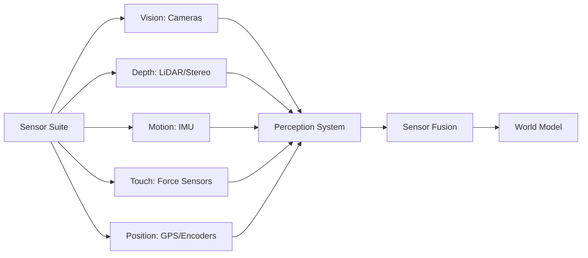

# Sensor Systems Overview

**Robots are blind without sensors.** While digital AI processes clean datasets, physical AI must extract meaning from noisy, real-time sensor data. Understanding sensor capabilities and limitations is the foundation of robotic perception.

## The Sensor Suite

Modern humanoid robots combine multiple sensor types, each excelling at specific tasks:

## Vision Systems

### RGB Cameras
**What they measure**: Color images (Red, Green, Blue channels)

**Use cases**:
- Object recognition (detect "red cup" vs "blue bottle")
- Traffic sign reading
- Human pose estimation
- Visual odometry (track motion by matching image features)

**Strengths**:
- Rich color information
- High resolution (4K+ available)
- Cheap ($5-$50 for robotics-grade cameras)

**Weaknesses**:
- No depth information (can't tell if object is 1m or 10m away)
- Sensitive to lighting (fails in darkness, blinded by direct sunlight)
- Motion blur during fast movement

**Example**: Tesla Optimus uses 8 RGB cameras (no depth sensors) and infers 3D structure using multi-view geometry, similar to human vision.

### Depth Cameras (RGB-D)
**What they measure**: Color + distance to each pixel

**Technologies**:
- **Structured light** (projects infrared pattern, measures distortion) - Intel RealSense D435
- **Time-of-flight (ToF)** (measures light travel time) - Microsoft Azure Kinect
- **Stereo vision** (two cameras compute disparity) - ZED 2

**Use cases**:
- 3D object reconstruction
- Obstacle avoidance (know exact distance to walls, people, furniture)
- Grasp point detection (find best location to grip an object)

**Strengths**:
- Combines color and depth in one sensor
- Works indoors and outdoors (ToF better in sunlight than structured light)

**Weaknesses**:
- Limited range (0.3m - 10m typical)
- Fails on transparent/reflective surfaces (glass, mirrors, shiny metal)
- Higher cost ($100-$400)

**Example**: Unitree G1 uses RealSense D435i for navigation and manipulation tasks.

## LiDAR (Light Detection and Ranging)

**What it measures**: Precise distance to objects using laser pulses

**Types**:
- **2D LiDAR** (scans horizontal plane) - Used in vacuum robots, warehouse AGVs
- **3D LiDAR** (scans full 360° sphere) - Used in self-driving cars, outdoor robots

**Use cases**:
- SLAM (Simultaneous Localization and Mapping)
- Collision detection at high speeds
- Accurate distance measurement (±2cm accuracy at 100m range)

**Strengths**:
- Works in total darkness
- Not affected by lighting changes or shadows
- Long range (100m+ for automotive LiDAR)
- High precision

**Weaknesses**:
- No color information
- Misses transparent surfaces (glass, water)
- Expensive ($200-$10,000 depending on resolution and range)
- Large power consumption

**Example**: Boston Dynamics Spot uses Velodyne VLP-16 LiDAR for 360° obstacle detection and terrain mapping.

## Inertial Measurement Units (IMUs)

**What they measure**: Acceleration and rotation in 3 axes

**Components**:
- **Accelerometer**: Measures linear acceleration (gravity, forward/backward motion)
- **Gyroscope**: Measures angular velocity (rotation speed around X, Y, Z axes)
- **Magnetometer** (optional): Measures magnetic field direction (compass heading)

**Use cases**:
- Balance control for bipedal walking
- Detecting falls
- Dead reckoning (estimate position when GPS unavailable)
- Stabilizing camera footage

**Strengths**:
- Very high update rate (100-1000 Hz)
- Cheap ($2-$50)
- Small and low power

**Weaknesses**:
- **Drift**: Small errors accumulate over time (gyroscope drift can cause 10° error after 10 minutes)
- Cannot measure absolute position (only changes in motion)
- Sensitive to vibration

**Example**: Every humanoid robot has an IMU in the torso to detect tipping and adjust balance in real-time.

## Force and Torque Sensors

**What they measure**: Forces (push/pull) and torques (twisting) at robot joints or grippers

**Use cases**:
- Gentle grasping (hold egg without cracking, hold hammer firmly)
- Collision detection (robot arm bumps person, immediately stops)
- Compliance control (robot follows human's push/pull during collaboration)

**Strengths**:
- Direct measurement of physical interaction
- Enables safe human-robot collaboration
- Detects contact that vision might miss (e.g., bumping hidden object)

**Weaknesses**:
- Expensive (6-axis force/torque sensor: $500-$3,000)
- Requires careful calibration
- Can be damaged by overload

**Example**: Tesla Optimus hands have tactile sensors in each finger to adjust grip force—light enough to hand you a fragile item, strong enough to carry tools.

## GPS and Positioning

**What it measures**: Absolute position on Earth (latitude, longitude, altitude)

**Use cases**:
- Outdoor navigation (delivery robots, agricultural robots)
- Waypoint following
- Return-to-home functions

**Strengths**:
- Global coverage (works anywhere outdoors)
- No drift over long distances

**Weaknesses**:
- **Does not work indoors** (buildings block satellite signals)
- Low accuracy (consumer GPS: ±5-10m; RTK GPS: ±2cm but requires base station)
- Update rate too slow for fast maneuvers (1-10 Hz typical)

**Alternative for indoors**: Motion capture systems (Vicon, OptiTrack) or visual-inertial odometry (camera + IMU fusion).

## Sensor Fusion: Why One Sensor Isn't Enough

**Problem**: Every sensor lies in some situations.

- Cameras fail in darkness
- LiDAR misses glass walls
- IMUs drift over time
- GPS doesn't work indoors

**Solution**: Sensor fusion combines multiple sensors to compensate for individual weaknesses.

### Example: Robot Localizing in a Building

1. **IMU** tracks rotation and acceleration (100 Hz update)
2. **Wheel encoders** measure how far wheels have turned (estimate distance traveled)
3. **LiDAR** scans walls and furniture, matches to known map
4. **Cameras** detect visual landmarks (doorways, posters)

**Sensor fusion algorithm** (Extended Kalman Filter):
- IMU provides fast updates (smooth motion between LiDAR scans)
- LiDAR corrects IMU drift every 0.1 seconds
- Camera confirms identity of landmarks ("this is the second-floor hallway, not third")
- Result: Accurate position estimate (±5cm) even though individual sensors have larger errors

### Common Fusion Techniques

- **Kalman Filters**: Combine sensor measurements with motion predictions
- **Particle Filters**: Track multiple position hypotheses, eliminate unlikely ones
- **Occupancy Grids**: Fuse LiDAR + camera to build 2D/3D maps marking free space vs obstacles

**You'll implement these in Module 3 (Simulation)** when building SLAM systems.

## Choosing Sensors: Trade-Offs

| **Sensor Type** | **Cost** | **Range** | **Accuracy** | **Update Rate** | **Environment** |
|-----------------|----------|-----------|--------------|-----------------|-----------------|
| RGB Camera | $ | Short-Med | Low (no depth) | High (30-60 Hz) | Light-dependent |
| Depth Camera | $$ | Short (0.3-10m) | Medium (cm-level) | Medium (30 Hz) | Indoor/Outdoor |
| 2D LiDAR | $$ | Medium (10-30m) | High (cm-level) | High (10-40 Hz) | Any light |
| 3D LiDAR | $$$$ | Long (100m+) | Very High (mm-level) | Medium (10-20 Hz) | Any light |
| IMU | $ | N/A (relative) | High (short-term) | Very High (100-1000 Hz) | Any |
| Force/Torque | $$$ | Touch only | High | High (100-1000 Hz) | Any |
| GPS | $ | Global | Low-Med (m to cm) | Low (1-10 Hz) | Outdoor only |

**Budget humanoid** (Unitree G1): RGB camera + depth camera + IMU + basic force sensors
**Premium humanoid** (Boston Dynamics Atlas): 3D LiDAR + stereo cameras + IMU + 6-axis force sensors at each joint

## What You'll Build

Throughout this book, you'll work with:

- **Module 1 (ROS 2)**: Subscribe to simulated camera and IMU topics
- **Module 2 (Simulation)**: Configure virtual sensors in Gazebo (LiDAR, depth camera, IMU)
- **Module 3 (Isaac Sim)**: Generate photorealistic synthetic sensor data (RGB, depth, segmentation masks)
- **Module 4 (VLA)**: Fuse camera + LiDAR for object detection and grasping

**All in simulation first**—no expensive hardware required.

## Summary

- **Vision systems**: RGB (color, no depth), depth cameras (3D structure), trade-offs in range and cost
- **LiDAR**: Accurate distance measurement, works in darkness, expensive, misses transparent objects
- **IMU**: Fast motion tracking, essential for balance, suffers from drift
- **Force sensors**: Enable safe physical interaction, detect contact, expensive
- **GPS**: Outdoor positioning, does not work indoors, requires RTK for cm accuracy
- **Sensor fusion**: Combine multiple sensors to overcome individual limitations (Kalman filters, particle filters)
- **Trade-offs**: Balance cost, range, accuracy, update rate, environmental robustness

**Next**: Move to the [Getting Started](/docs/getting-started/index) section and set up your development environment for hands-on learning.
