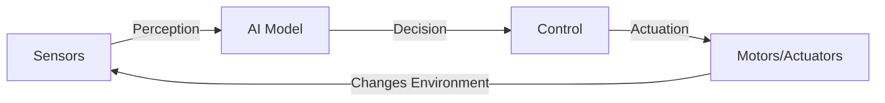

# What is Physical AI?

**Physical AI is intelligence that interacts with the physical world.** Unlike ChatGPT or image generators that exist purely in digital space, physical AI systems have sensors, motors, and bodies. They perceive, decide, and act in real environments.

## Digital AI vs. Physical AI

| **Digital AI** | **Physical AI** |
|----------------|-----------------|
| Processes text, images, audio | Processes **sensor data** (cameras, LiDAR, force sensors) |
| Outputs predictions, text, images | Outputs **motor commands** (move joints, navigate, grasp) |
| Lives in cloud servers | Lives in **physical robots** |
| Trained on internet data | Trained on **interaction data** (sim + real) |
| Latency: milliseconds OK | Latency: **real-time critical** (`<10ms`) |
| Failure = wrong answer | Failure = **physical damage** or injury |

**Example**: An LLM can describe how to pour coffee. A physical AI robot can actually pour it—sensing the cup position, controlling arm motors, adjusting grip force, and stopping when the cup is full.

## The Sensor-Action Loop

All physical AI systems follow the same pattern:

**1. Sensors** (eyes, ears, touch):
- Cameras capture RGB images
- LiDAR measures distances to obstacles
- IMUs track orientation and acceleration
- Force sensors detect contact

**2. Perception** (understanding):
- Object detection: "I see a red cup at (x, y, z)"
- Localization: "I'm 2 meters from the wall"
- State estimation: "My right arm is bent 45°"

**3. Decision** (planning):
- Path planning: "Navigate around the chair"
- Task planning: "Pick up cup, then place on table"
- LLM integration: "Voice command 'bring me coffee' → pick(coffee) + navigate(user)"

**4. Control** (execution):
- Joint control: "Set shoulder joint to 30°"
- Velocity control: "Move forward at 0.5 m/s"
- Force control: "Grasp with 5 Newtons pressure"

**5. Actuation** (physical change):
- Electric motors rotate joints
- Wheels or legs move the robot
- Grippers open and close

This loop runs continuously at 10-100 Hz (10-100 times per second), adjusting actions based on new sensor data.

## Why Embodied Intelligence is Hard

Digital AI has one job: predict the next token or pixel. Physical AI must handle:

### 1. Real-Time Constraints
A robot can't pause to "think" for 30 seconds while falling. Decisions must happen in milliseconds.

### 2. Uncertainty and Noise
Sensors lie. A camera sees glare. LiDAR misses glass. GPS drifts indoors. Physical AI must work despite imperfect information.

### 3. Safety-Critical Operation
Wrong text generation = embarrassment. Wrong robot motion = broken equipment or injured people.

### 4. Sim-to-Real Gap
Training in simulation (perfect physics, no sensor noise) doesn't guarantee success in the real world (friction varies, objects slip, lighting changes).

### 5. Continuous Learning
Robots must adapt to new environments. Your home is different from my home. A warehouse robot trained on empty floors must handle unexpected obstacles.

## Summary

- Physical AI = intelligence with a body (sensors + actuators)
- Core loop: sense → perceive → decide → control → act → repeat
- Challenges: real-time constraints, noisy sensors, safety, sim-to-real gap
- LLMs provide reasoning; robotics provides embodiment
- Humanoids are universal platforms for human environments

**Next**: Learn [Why Physical AI Matters](/docs/introduction/why-physical-ai-matters) for society and your career.
