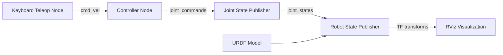

# Project: Build Your ROS 2 Package

**Time to integrate everything you've learned.** You've mastered nodes, topics, services, launch files, and URDF. Now build a complete ROS 2 package from scratch: a humanoid robot controller with keyboard teleoperation, joint state monitoring, and RViz visualization.

## Project Overview

**Build**: `humanoid_controller` package
**Goal**: Control a 10-DOF humanoid robot using keyboard input
**Duration**: 4-6 hours
**Difficulty**: Intermediate

### What You'll Build



**Four integrated components**:
1. **Teleoperation node**: Capture keyboard input (WASD keys), publish velocity commands
2. **Controller node**: Convert velocity commands to joint angles (inverse kinematics stub)
3. **URDF model**: 10-DOF humanoid from previous chapter
4. **Launch file**: Start all nodes with proper parameters and namespaces

## Learning Objectives

By completing this project, you will:
- Design and implement a multi-node ROS 2 system
- Use topics for inter-node communication
- Create custom message types (optional stretch goal)
- Structure a Python package with proper dependencies
- Write comprehensive launch files with parameters
- Integrate URDF models with robot_state_publisher
- Visualize robot state in RViz
- Debug multi-node systems using ROS 2 tools

## Requirements

### Functional Requirements

**FR1: Keyboard Teleoperation**
- Node name: `keyboard_teleop_node`
- Subscribe to keyboard input (use `getch()` or `pynput` library)
- Publish to `/cmd_vel` topic (message type: `geometry_msgs/Twist`)
- Key mappings:
  - `W`: Forward walk (linear.x = 0.5)
  - `S`: Backward walk (linear.x = -0.5)
  - `A`: Turn left (angular.z = 0.5)
  - `D`: Turn right (angular.z = -0.5)
  - `Q`: Quit node
- Publish rate: 10 Hz
- Log key presses to console

**FR2: Joint Controller**
- Node name: `joint_controller_node`
- Subscribe to `/cmd_vel` (geometry_msgs/Twist)
- Publish to `/joint_commands` (sensor_msgs/JointState)
- Convert velocity commands to joint angles:
  - Forward/backward: Hip and knee joints (simulate walking)
  - Left/right: Shoulder joints (simulate arm swing)
  - Use simple linear mapping (no complex IK required)
- Publish rate: 50 Hz
- Joint limits enforcement (from URDF)

**FR3: URDF Visualization**
- Reuse humanoid URDF from previous chapter
- Launch robot_state_publisher with URDF parameter
- Launch joint_state_publisher_gui for manual control (optional mode)
- Publish TF transforms for all links

**FR4: Launch System**
- Single launch file: `humanoid_system.launch.py`
- Start all nodes: teleop, controller, robot_state_publisher, RViz
- Load URDF from package share directory
- Launch arguments:
  - `use_sim_time`: Boolean (default: false)
  - `rviz`: Boolean to enable/disable RViz (default: true)
  - `teleop`: Boolean to enable/disable teleop (default: true)
- Proper parameter passing to all nodes

### Non-Functional Requirements

**NFR1: Code Quality**
- Follow PEP 8 style guidelines
- Docstrings for all classes and functions
- Type hints for function parameters
- No hardcoded paths (use `get_package_share_directory()`)

**NFR2: Package Structure**
```
humanoid_controller/
├── package.xml          # Dependencies and metadata
├── setup.py             # Python package configuration
├── setup.cfg            # Install configuration
├── resource/            # ament resource marker
├── humanoid_controller/ # Python source code
│   ├── __init__.py
│   ├── keyboard_teleop_node.py
│   └── joint_controller_node.py
├── urdf/
│   └── humanoid.urdf.xacro
├── launch/
│   └── humanoid_system.launch.py
├── config/
│   └── joint_limits.yaml
└── rviz/
    └── humanoid_view.rviz
```

**NFR3: Documentation**
- README.md with setup instructions, usage, and troubleshooting
- Inline comments for complex logic
- Example commands for running nodes individually

**NFR4: Testing**
- Verify all nodes start without errors
- Check topic communication with `ros2 topic echo`
- Validate joint limits are enforced
- Test launch file with different argument combinations

## Implementation Steps

### Step 1: Create Package (30 minutes)

```bash
cd ~/ros2_ws/src
ros2 pkg create humanoid_controller \
  --build-type ament_python \
  --dependencies rclpy std_msgs sensor_msgs geometry_msgs
```

**Edit `package.xml`**:
```xml
<depend>rclpy</depend>
<depend>std_msgs</depend>
<depend>sensor_msgs</depend>
<depend>geometry_msgs</depend>
<depend>robot_state_publisher</depend>
<depend>joint_state_publisher_gui</depend>
<depend>xacro</depend>

<exec_depend>pynput</exec_depend>  <!-- For keyboard input -->
```

**Edit `setup.py`**:
```python
entry_points={
    'console_scripts': [
        'keyboard_teleop = humanoid_controller.keyboard_teleop_node:main',
        'joint_controller = humanoid_controller.joint_controller_node:main',
    ],
},
data_files=[
    ('share/ament_index/resource_index/packages',
        ['resource/' + package_name]),
    ('share/' + package_name, ['package.xml']),
    ('share/' + package_name + '/launch', ['launch/humanoid_system.launch.py']),
    ('share/' + package_name + '/urdf', ['urdf/humanoid.urdf.xacro']),
    ('share/' + package_name + '/config', ['config/joint_limits.yaml']),
    ('share/' + package_name + '/rviz', ['rviz/humanoid_view.rviz']),
],
```

### Step 2: Implement Keyboard Teleop Node (45 minutes)

**File**: `humanoid_controller/keyboard_teleop_node.py`

```python
import rclpy
from rclpy.node import Node
from geometry_msgs.msg import Twist
from pynput import keyboard

class KeyboardTeleopNode(Node):
    def __init__(self):
        super().__init__('keyboard_teleop_node')
        self.publisher_ = self.create_publisher(Twist, '/cmd_vel', 10)
        self.timer = self.create_timer(0.1, self.publish_cmd_vel)  # 10 Hz

        self.current_twist = Twist()
        self.get_logger().info('Keyboard Teleop Node Started')
        self.get_logger().info('Controls: W=Forward, S=Backward, A=Left, D=Right, Q=Quit')

        # Start keyboard listener
        self.listener = keyboard.Listener(on_press=self.on_key_press)
        self.listener.start()

    def on_key_press(self, key):
        try:
            if key.char == 'w':
                self.current_twist.linear.x = 0.5
                self.get_logger().info('Forward')
            elif key.char == 's':
                self.current_twist.linear.x = -0.5
                self.get_logger().info('Backward')
            elif key.char == 'a':
                self.current_twist.angular.z = 0.5
                self.get_logger().info('Turn Left')
            elif key.char == 'd':
                self.current_twist.angular.z = -0.5
                self.get_logger().info('Turn Right')
            elif key.char == 'q':
                self.get_logger().info('Quitting...')
                rclpy.shutdown()
        except AttributeError:
            # Special keys (arrows, shift, etc.)
            pass

    def publish_cmd_vel(self):
        self.publisher_.publish(self.current_twist)
        # Decay velocities (return to zero if no key pressed)
        self.current_twist.linear.x *= 0.9
        self.current_twist.angular.z *= 0.9

def main(args=None):
    rclpy.init(args=args)
    node = KeyboardTeleopNode()
    try:
        rclpy.spin(node)
    except KeyboardInterrupt:
        pass
    finally:
        node.destroy_node()
        rclpy.shutdown()

if __name__ == '__main__':
    main()
```

### Step 3: Implement Joint Controller Node (60 minutes)

**File**: `humanoid_controller/joint_controller_node.py`

```python
import rclpy
from rclpy.node import Node
from geometry_msgs.msg import Twist
from sensor_msgs.msg import JointState
import math

class JointControllerNode(Node):
    def __init__(self):
        super().__init__('joint_controller_node')

        # Subscriber to velocity commands
        self.subscription = self.create_subscription(
            Twist, '/cmd_vel', self.cmd_vel_callback, 10)

        # Publisher for joint commands
        self.publisher_ = self.create_publisher(JointState, '/joint_commands', 10)
        self.timer = self.create_timer(0.02, self.publish_joint_commands)  # 50 Hz

        # Joint state message
        self.joint_state = JointState()
        self.joint_state.name = [
            'left_shoulder', 'left_elbow', 'right_shoulder', 'right_elbow',
            'left_hip', 'left_knee', 'right_hip', 'right_knee',
            'neck'
        ]
        self.joint_state.position = [0.0] * len(self.joint_state.name)

        # Current velocity commands
        self.linear_x = 0.0
        self.angular_z = 0.0

        # Oscillation phase for walking animation
        self.phase = 0.0

        self.get_logger().info('Joint Controller Node Started')

    def cmd_vel_callback(self, msg: Twist):
        self.linear_x = msg.linear.x
        self.angular_z = msg.angular.z

    def publish_joint_commands(self):
        # Simple walking simulation: oscillate legs based on linear velocity
        if abs(self.linear_x) > 0.01:
            self.phase += 0.1 * self.linear_x

            # Hip joints (walking motion)
            hip_amplitude = 0.5 * abs(self.linear_x)
            self.joint_state.position[4] = hip_amplitude * math.sin(self.phase)  # left_hip
            self.joint_state.position[6] = hip_amplitude * math.sin(self.phase + math.pi)  # right_hip

            # Knee joints (bend when leg swings forward)
            knee_amplitude = 0.3 * abs(self.linear_x)
            self.joint_state.position[5] = max(0, knee_amplitude * math.sin(self.phase))  # left_knee
            self.joint_state.position[7] = max(0, knee_amplitude * math.sin(self.phase + math.pi))  # right_knee

        # Arm swing (counter to leg motion)
        if abs(self.linear_x) > 0.01:
            arm_amplitude = 0.3 * abs(self.linear_x)
            self.joint_state.position[0] = -arm_amplitude * math.sin(self.phase)  # left_shoulder
            self.joint_state.position[2] = -arm_amplitude * math.sin(self.phase + math.pi)  # right_shoulder

        # Turn head based on angular velocity
        if abs(self.angular_z) > 0.01:
            self.joint_state.position[8] = 0.5 * self.angular_z  # neck

        # Enforce joint limits (from URDF)
        self.joint_state.position = [
            max(-1.57, min(1.57, pos)) for pos in self.joint_state.position
        ]

        # Publish
        self.joint_state.header.stamp = self.get_clock().now().to_msg()
        self.publisher_.publish(self.joint_state)

def main(args=None):
    rclpy.init(args=args)
    node = JointControllerNode()
    try:
        rclpy.spin(node)
    except KeyboardInterrupt:
        pass
    finally:
        node.destroy_node()
        rclpy.shutdown()

if __name__ == '__main__':
    main()
```

### Step 4: Create Launch File (45 minutes)

**File**: `launch/humanoid_system.launch.py`

```python
import os
from ament_index_python.packages import get_package_share_directory
from launch import LaunchDescription
from launch.actions import DeclareLaunchArgument, IncludeLaunchDescription
from launch.conditions import IfCondition
from launch.substitutions import LaunchConfiguration
from launch_ros.actions import Node
import xacro

def generate_launch_description():
    pkg_dir = get_package_share_directory('humanoid_controller')

    # Launch arguments
    use_sim_time_arg = DeclareLaunchArgument(
        'use_sim_time', default_value='false',
        description='Use simulation time')

    rviz_arg = DeclareLaunchArgument(
        'rviz', default_value='true',
        description='Launch RViz')

    teleop_arg = DeclareLaunchArgument(
        'teleop', default_value='true',
        description='Launch keyboard teleop node')

    # Process URDF
    xacro_file = os.path.join(pkg_dir, 'urdf', 'humanoid.urdf.xacro')
    robot_description = xacro.process_file(xacro_file).toxml()

    # Nodes
    robot_state_publisher = Node(
        package='robot_state_publisher',
        executable='robot_state_publisher',
        parameters=[{
            'robot_description': robot_description,
            'use_sim_time': LaunchConfiguration('use_sim_time')
        }]
    )

    joint_controller = Node(
        package='humanoid_controller',
        executable='joint_controller',
        parameters=[{'use_sim_time': LaunchConfiguration('use_sim_time')}]
    )

    keyboard_teleop = Node(
        package='humanoid_controller',
        executable='keyboard_teleop',
        condition=IfCondition(LaunchConfiguration('teleop')),
        parameters=[{'use_sim_time': LaunchConfiguration('use_sim_time')}]
    )

    rviz = Node(
        package='rviz2',
        executable='rviz2',
        condition=IfCondition(LaunchConfiguration('rviz')),
        arguments=['-d', os.path.join(pkg_dir, 'rviz', 'humanoid_view.rviz')]
    )

    return LaunchDescription([
        use_sim_time_arg,
        rviz_arg,
        teleop_arg,
        robot_state_publisher,
        joint_controller,
        keyboard_teleop,
        rviz
    ])
```

### Step 5: Copy URDF and Build (30 minutes)

1. Copy `humanoid.urdf.xacro` from previous chapter to `urdf/` directory
2. Create empty `rviz/humanoid_view.rviz` (RViz will save config when you set it up)
3. Create `config/joint_limits.yaml` with joint limits from URDF

**Build**:
```bash
cd ~/ros2_ws
colcon build --packages-select humanoid_controller
source install/setup.bash
```

### Step 6: Test and Debug (60 minutes)

**Test individual nodes**:
```bash
# Terminal 1: Joint controller
ros2 run humanoid_controller joint_controller

# Terminal 2: Keyboard teleop
ros2 run humanoid_controller keyboard_teleop

# Terminal 3: Monitor topics
ros2 topic echo /cmd_vel
ros2 topic echo /joint_commands
```

**Test launch file**:
```bash
ros2 launch humanoid_controller humanoid_system.launch.py
```

**In RViz**:
- Add **RobotModel** display
- Set **Fixed Frame** to `base_link`
- Add **TF** display to see coordinate frames
- Press W/A/S/D keys in teleop terminal to control robot

## Acceptance Criteria

- [ ] Package builds with zero warnings
- [ ] All nodes start without errors
- [ ] Keyboard teleop publishes to `/cmd_vel` at 10 Hz
- [ ] Joint controller subscribes to `/cmd_vel` and publishes `/joint_commands` at 50 Hz
- [ ] Robot visualizes in RViz with correct joint movements
- [ ] W/A/S/D keys control robot motion
- [ ] Joint limits are enforced (no positions outside URDF limits)
- [ ] Launch file starts all nodes successfully
- [ ] Launch arguments work (rviz:=false, teleop:=false)
- [ ] README.md documents installation and usage
- [ ] Code follows PEP 8 style guidelines

## Stretch Goals (Optional)

1. **Custom Message Type**: Define `humanoid_controller_msgs/JointCommand` with additional fields (effort, velocity)
2. **Service for Poses**: Implement `/set_pose` service to move robot to predefined poses (T-pose, crouch, wave)
3. **Joint Trajectory**: Use `trajectory_msgs/JointTrajectory` for smooth motion instead of instant position changes
4. **Gamepad Support**: Add joystick input using `joy` package
5. **Simulation Integration**: Test in Gazebo Classic with physics
6. **Unit Tests**: Add pytest tests for controller logic

## Troubleshooting

### Issue: ImportError for pynput
**Fix**: Install with `pip install pynput` or use alternative keyboard library

### Issue: robot_state_publisher not publishing TF
**Cause**: Missing `/joint_states` topic
**Fix**: Remap `/joint_commands` to `/joint_states` in launch file:
```python
joint_controller = Node(
    package='humanoid_controller',
    executable='joint_controller',
    remappings=[('/joint_commands', '/joint_states')]
)
```

### Issue: RViz shows robot in weird pose
**Cause**: Joint angles exceed URDF limits
**Fix**: Add clamping in controller:
```python
position = max(lower_limit, min(upper_limit, position))
```

### Issue: Teleop keys not registering
**Cause**: Terminal focus not on teleop node
**Fix**: Click on teleop terminal before pressing keys. Add visual feedback (print statements) to confirm input.

## Deliverables

1. **Complete package** in `~/ros2_ws/src/humanoid_controller/`
2. **README.md** with:
   - Project description
   - Installation instructions
   - Usage examples
   - Known issues and limitations
3. **Screen recording** (optional): 30-60 second video showing robot control in RViz

## Summary

You've built a complete ROS 2 system from scratch integrating:
- Multi-node architecture (teleoperation, control, visualization)
- Topic-based communication (`/cmd_vel`, `/joint_commands`, `/joint_states`)
- URDF modeling and TF transforms
- Launch files with parameters and conditionals
- Package structure with proper dependencies

**Next Module**: Take this ROS 2 foundation into [Module 2: Simulation with Gazebo](/docs/module-02-simulation/index), where you'll add physics, sensors, and realistic environments.
