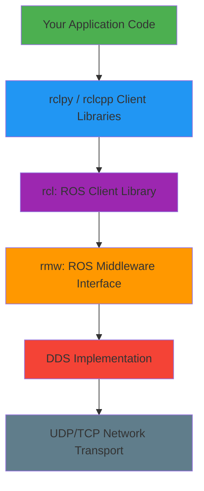

# ROS 2 Architecture

**ROS 2 is built on layers, like a network stack.** At the bottom, DDS handles low-level communication. At the top, your Python or C++ code runs as nodes. Understanding this architecture is essential for building reliable robot systems.

## The Big Picture: Layered Architecture



**What each layer does**:

1. **Application Code** (your robot logic): Publishers, subscribers, service servers/clients written in Python or C++
2. **rclpy / rclcpp**: Language-specific client libraries (Python vs C++)
3. **rcl**: Core ROS 2 functionality (language-agnostic)
4. **rmw**: Abstraction layer that supports multiple DDS vendors
5. **DDS**: Actual communication protocol (like HTTP for web, but for robots)
6. **Network Transport**: UDP or TCP over ethernet/WiFi

**Why layers matter**: You write code at Layer 1. ROS 2 handles Layers 2-6 automatically. But understanding what's underneath helps you debug issues and optimize performance.

## DDS: The Communication Backbone

**DDS (Data Distribution Service)** is an OMG standard for real-time, publish-subscribe communication.

**Why ROS 2 switched from ROS 1 to DDS**:
- **Real-time performance**: DDS has deterministic latency (`<1ms` possible)
- **Reliability**: Built-in acknowledgments, retransmission, and ordering guarantees
- **Security**: DDS-Security provides authentication and encryption
- **Scalability**: Supports thousands of nodes across multiple machines

**Popular DDS implementations** (ROS 2 supports multiple):
- **Fast DDS** (eProsima) - Default in ROS 2 Humble, optimized for speed
- **CycloneDDS** (Eclipse) - Lightweight, good for embedded systems
- **RTI Connext DDS** - Industrial-grade, used in aerospace/defense (commercial license)

**You rarely interact with DDS directly.** ROS 2's `rmw` layer abstracts it away. But knowing it exists helps you understand Quality of Service (QoS) settings later.

## Nodes: The Building Blocks

A **node** is a single executable program that performs one specific task.

**Examples**:
- `camera_node`: Publishes RGB images from a camera
- `object_detector_node`: Subscribes to images, publishes detected objects
- `motion_planner_node`: Computes collision-free paths
- `motor_controller_node`: Sends velocity commands to motors

**Why many small nodes instead of one big program?**
- **Modularity**: Replace `camera_node` without touching object detection code
- **Debugging**: Test each node independently
- **Fault isolation**: If one node crashes, others keep running
- **Parallel execution**: Nodes run on different CPU cores or even different computers

### Node Graph

The **node graph** visualizes which nodes communicate with each other.

**Example scenario**: A humanoid robot picking up a cup:

```mermaid
graph LR
    A[camera_node] -->|/camera/rgb| B[object_detector_node]
    B -->|/detected_objects| C[grasp_planner_node]
    C -->|/arm/target_pose| D[motion_planner_node]
    D -->|/joint_commands| E[robot_controller_node]
    E -->|Joint states| F[/robot_hardware]
```

**View your own node graph**:
```bash
ros2 run rqt_graph rqt_graph
```

This GUI shows nodes (boxes) and topics (arrows) in real-time.

## Topics: Streaming Data

**Topics** are named buses for continuous data streams. Like radio stations: nodes can broadcast on a topic, and any node can tune in.

### Publisher/Subscriber Pattern

**Publisher**: Sends messages to a topic (e.g., camera publishes images to `/camera/rgb`)

**Subscriber**: Receives messages from a topic (e.g., object detector subscribes to `/camera/rgb`)

**Key properties**:
- **Many-to-many**: Multiple publishers and subscribers can share one topic
- **Asynchronous**: Publishers don't wait for subscribers
- **Lossy by default**: If subscriber is slow, messages may be dropped (configurable via QoS)

**Example: Publishing sensor data**

```python
import rclpy
from rclpy.node import Node
from sensor_msgs.msg import LaserScan

class LidarPublisher(Node):
    def __init__(self):
        super().__init__('lidar_publisher')
        self.publisher = self.create_publisher(LaserScan, '/scan', 10)
        self.timer = self.create_timer(0.1, self.publish_scan)  # 10 Hz

    def publish_scan(self):
        msg = LaserScan()
        msg.header.stamp = self.get_clock().now().to_msg()
        msg.ranges = [1.0, 2.0, 3.0]  # Simplified scan data
        self.publisher.publish(msg)
        self.get_logger().info('Published scan')
```

**Example: Subscribing to sensor data**

```python
class LidarSubscriber(Node):
    def __init__(self):
        super().__init__('lidar_subscriber')
        self.subscription = self.create_subscription(
            LaserScan, '/scan', self.scan_callback, 10)

    def scan_callback(self, msg):
        self.get_logger().info(f'Received scan with {len(msg.ranges)} points')
```

**When to use topics**: Continuous data streams (sensor readings, robot state, video feeds).

## Services: Request/Response

**Services** are synchronous calls for on-demand computation. Like a function call over the network.

**Client**: Sends a request and waits for a response

**Server**: Receives request, computes, returns response

**Key properties**:
- **Blocking**: Client waits for server to respond (use timeouts!)
- **One-to-one**: One client talks to one server at a time
- **Not for continuous data**: Use topics for streaming

**Example: Adding two integers**

**Server**:
```python
from example_interfaces.srv import AddTwoInts

class AddTwoIntsServer(Node):
    def __init__(self):
        super().__init__('add_two_ints_server')
        self.srv = self.create_service(AddTwoInts, 'add_two_ints', self.add_callback)

    def add_callback(self, request, response):
        response.sum = request.a + request.b
        self.get_logger().info(f'{request.a} + {request.b} = {response.sum}')
        return response
```

**Client**:
```python
class AddTwoIntsClient(Node):
    def __init__(self):
        super().__init__('add_two_ints_client')
        self.cli = self.create_client(AddTwoInts, 'add_two_ints')
        while not self.cli.wait_for_service(timeout_sec=1.0):
            self.get_logger().info('Waiting for service...')

    def send_request(self, a, b):
        req = AddTwoInts.Request()
        req.a = a
        req.b = b
        future = self.cli.call_async(req)
        return future
```

**When to use services**: On-demand computations (inverse kinematics, pathfinding, triggering actions).

## Actions: Long-Running Goals

**Actions** are for tasks that take time and provide feedback (like services, but asynchronous with progress updates).

**Client**: Sends a goal (e.g., "navigate to (x, y)")

**Server**: Accepts goal, sends periodic feedback (e.g., "50% complete"), returns final result

**Key properties**:
- **Asynchronous with feedback**: Client gets progress updates (unlike services)
- **Cancellable**: Client can cancel goal mid-execution
- **Preemptable**: New goal can override current one

**Example: Navigation action**

```python
# Client sends goal
goal_msg = NavigateToPose.Goal()
goal_msg.pose.position.x = 5.0
goal_msg.pose.position.y = 3.0
goal_handle = action_client.send_goal_async(goal_msg, feedback_callback=feedback_cb)

# Server sends feedback every 0.5 seconds
def execute_callback(self, goal_handle):
    for i in range(10):
        feedback = NavigateToPose.Feedback()
        feedback.distance_remaining = 10.0 - i
        goal_handle.publish_feedback(feedback)
        time.sleep(0.5)

    result = NavigateToPose.Result()
    result.success = True
    return result
```

**When to use actions**: Long tasks with progress tracking (navigation, grasping, trajectory execution).

## Quality of Service (QoS) Policies

**QoS** determines how reliably and efficiently messages are delivered.

**Why QoS matters**: A camera stream tolerates dropped frames. A safety stop command must **never** be lost.

### Key QoS Settings

| Policy | Options | Use Case |
|--------|---------|----------|
| **Reliability** | Best Effort, Reliable | Best Effort: sensor data (OK to drop). Reliable: commands (no drops) |
| **Durability** | Volatile, Transient Local | Volatile: real-time only. Transient Local: late subscribers get last message |
| **History** | Keep Last (N), Keep All | Keep Last 10: keep recent 10 messages. Keep All: never drop (risky) |
| **Deadline** | Duration | Alert if messages arrive slower than expected |
| **Liveliness** | Automatic, Manual | Detect if publisher crashes |

**Example: Critical command topic**

```python
from rclpy.qos import QoSProfile, ReliabilityPolicy, DurabilityPolicy

qos_profile = QoSProfile(
    reliability=ReliabilityPolicy.RELIABLE,  # Never drop
    durability=DurabilityPolicy.TRANSIENT_LOCAL,  # Late subscribers get last msg
    depth=10  # Keep last 10 messages
)

self.publisher = self.create_publisher(String, '/emergency_stop', qos_profile)
```

**Default QoS**: Most topics use `depth=10`, `Reliable`, `Volatile`. This works for 90% of cases.

**When to customize QoS**: Safety-critical commands, sensor fusion, late-joining nodes.

## Communication Patterns Summary

| Pattern | Continuous? | Synchronous? | Feedback? | Use Case |
|---------|-------------|--------------|-----------|----------|
| **Topic** | Yes | No | No | Sensor streams, robot state |
| **Service** | No | Yes | No | On-demand computation |
| **Action** | No | No | Yes | Long-running tasks with progress |

**Most robots use all three**:
- Topics: Sensor data flows continuously
- Services: Request inverse kinematics on demand
- Actions: Execute navigation goals with progress updates

## Summary

- **Layered architecture**: Application → rclpy → rcl → rmw → DDS → network
- **DDS**: Real-time pub/sub middleware (Fast DDS default in Humble)
- **Nodes**: Modular executables, one task per node, visualized in node graph
- **Topics**: Asynchronous, many-to-many streaming data (pub/sub pattern)
- **Services**: Synchronous, one-to-one request/response (blocking calls)
- **Actions**: Asynchronous, feedback-enabled, cancellable long-running tasks
- **QoS**: Reliability, durability, history policies control message delivery

**Next**: Put theory into practice with [Nodes, Topics, Services](/docs/module-01-ros2/nodes-topics-services) hands-on tutorial.
