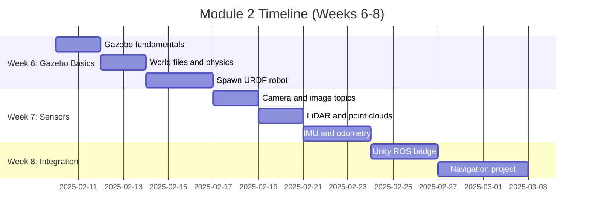

# Module 2: Simulation Environments - Your Robot's Virtual Testing Ground

**Hardware breaks. Simulation doesn't.** A single dropped robot costs thousands of dollars and weeks of repair time. Before touching real hardware, you'll test everything in simulation: navigation algorithms, sensor fusion, grasping strategies, and reinforcement learning policies. This module teaches you to build photorealistic simulations where robots learn safely at 100x real-world speed.

## Why Simulation Matters

**The Tesla Problem**: Training a humanoid robot in the real world requires:
- 10,000+ hours of human supervision
- $2M+ in hardware replacements from crashes
- 6-12 months of iteration time

**The Simulation Solution**: Train the same robot in Isaac Sim:
- 100,000 simulated hours in 1 week (GPU parallelization)
- Zero hardware damage
- Instant environment resets
- Perfect ground truth for debugging

**Real-world impact:**
- **Boston Dynamics**: Spot's parkour moves trained first in PyBullet simulation
- **Tesla Optimus**: All manipulation policies developed in Isaac Sim before hardware deployment
- **Unitree G1**: Walking gaits tuned in MuJoCo, then transferred to hardware with `<5%` performance loss

## What You'll Build

By the end of this module, you'll have:

1. **Indoor navigation environment** (Gazebo) with realistic office layout
2. **Sensor-equipped humanoid** with camera, LiDAR, IMU publishing ROS 2 topics
3. **Real-time visualization** of sensor data in RViz
4. **Unity integration** for VR/AR applications (optional)
5. **Isaac Sim pipeline** foundation for Module 3

## Module Structure (3 Weeks)

### Week 6: Gazebo Fundamentals (Hours 1-20)
**Goal**: Launch humanoid robot in custom Gazebo world

- **Gazebo Architecture** (4 hours)
  - Client-server model, gazebo_ros packages
  - SDF world files, model plugins
  - Physics engines: ODE, Bullet, DART comparison
- **Creating Worlds** (6 hours)
  - Building layouts with primitives and meshes
  - Lighting, materials, collision geometry
  - Dynamic obstacles and actors
- **Spawning Robots** (10 hours)
  - Integrating URDF with Gazebo plugins
  - gazebo_ros_control for joint control
  - Debugging visualization and transform issues

**Milestone**: Humanoid stands in office environment, controllable via ROS 2 topics

### Week 7: Sensor Integration (Hours 21-40)
**Goal**: Humanoid publishes camera, LiDAR, and IMU data

- **Camera Simulation** (6 hours)
  - gazebo_ros_camera plugin configuration
  - RGB, depth, and segmentation cameras
  - Image republishing and compression
- **LiDAR and Ray Sensors** (7 hours)
  - Ray plugin for 2D/3D LiDAR
  - Point cloud generation and filtering
  - LaserScan message format
- **IMU and Ground Truth** (7 hours)
  - gazebo_ros_imu_sensor plugin
  - Odometry from ground truth poses
  - TF tree integration

**Milestone**: RViz displays real-time camera feed, LiDAR scan, and IMU orientation

### Week 8: Advanced Simulation (Hours 41-60)
**Goal**: Multi-platform simulation pipeline

- **Unity Integration** (10 hours)
  - Unity Robotics Hub setup
  - URDF Importer for robot models
  - ROS-TCP-Connector bridge
- **Module Project** (10 hours)
  - Autonomous navigation in Gazebo
  - Obstacle avoidance with LiDAR
  - Goal-reaching behavior

**Milestone**: Humanoid navigates to waypoints avoiding obstacles, 90%+ success rate

## Simulation Platform Comparison

| Feature | Gazebo Classic | Gazebo Fortress | Unity | Isaac Sim |
|---------|---------------|-----------------|-------|-----------|
| **Physics** | ODE/Bullet | DART | PhysX | PhysX 5 |
| **Graphics** | OGRE | Ogre2 | HDRP | RTX Path Tracing |
| **ROS 2** | ✅ Native | ✅ Native | 🔶 Bridge | ✅ Native |
| **Sensors** | Basic | Improved | Custom | Photorealistic |
| **GPU Accel** | ❌ Limited | ✅ Partial | ✅ Full | ✅ Full |
| **Real-time** | ✅ Yes | ✅ Yes | ✅ Yes | 🔶 Depends |
| **Learning** | Easy | Moderate | Moderate | Advanced |
| **Cost** | Free | Free | Free (Personal) | Free (Personal) |

**This module focuses on**: Gazebo Classic (broad compatibility) + Unity (visualization) + Isaac Sim foundation (Module 3)

## Learning Outcomes

After completing this module, you will:

1. **Design simulation environments** with realistic physics, lighting, and collision geometry
2. **Integrate sensor plugins** (camera, LiDAR, IMU, force sensors) with proper noise models
3. **Debug sim-to-real transfer** issues (contact dynamics, sensor bandwidth, timing)
4. **Optimize simulation performance** (physics step size, sensor rates, parallel worlds)
5. **Visualize sensor data** in RViz and custom viewers
6. **Build Unity-ROS 2 bridge** for VR/AR applications

## Prerequisites

**From Module 1** (Required):
- ROS 2 fundamentals (nodes, topics, services)
- URDF modeling and xacro
- Launch files and parameters

**New Requirements**:
- Gazebo Classic 11+ (install: `sudo apt install gazebo11 ros-humble-gazebo-ros-pkgs`)
- Unity 2021.3 LTS (optional, for Week 8)
- Isaac Sim 2023.1.1 (Module 3 prerequisite, install guide in Module 3)

**Hardware**:
- **Minimum**: 8GB RAM, integrated GPU (Gazebo only, reduced quality)
- **Recommended**: 16GB RAM, NVIDIA GTX 1660+ (full Gazebo + Unity)
- **Optimal**: 32GB RAM, NVIDIA RTX 4070+ (Isaac Sim preparation)

## Tools and Libraries

**Simulation**:
- Gazebo Classic 11 (physics simulation)
- gazebo_ros_pkgs (ROS 2 integration)
- ros2_control (joint controllers)

**Visualization**:
- RViz2 (sensor data)
- rqt_image_view (camera streams)
- Plotjuggler (IMU data plotting)

**Unity (Optional)**:
- Unity Robotics Hub
- URDF Importer
- ROS-TCP-Connector

## Projects and Exercises

### Hands-On Exercises
1. **World Building**: Create multi-room office with doors, furniture, lighting
2. **Sensor Tuning**: Match LiDAR range and resolution to Velodyne VLP-16 specs
3. **Plugin Customization**: Modify camera plugin to add lens distortion
4. **Performance Profiling**: Optimize 10-robot simulation to run real-time

### Module Project: Autonomous Indoor Navigation
**Objective**: Humanoid navigates from point A to B avoiding dynamic obstacles

**Requirements**:
- Gazebo world with 5+ rooms, 10+ obstacles
- Humanoid with camera + LiDAR + IMU
- Obstacle detection using sensor fusion
- Goal-reaching success rate >90% over 20 trials

**Deliverable**: Recorded video + ROS bag file + launch instructions

## Common Challenges

### Challenge 1: Slow Simulation
**Symptom**: Gazebo runs at 0.3x real-time
**Causes**:
- High-polygon meshes (>10k tris per model)
- Too many ray casts (LiDAR resolution too high)
- Physics step size too small (`<1ms`)
**Fixes**:
- Simplify collision geometry (use primitives)
- Reduce LiDAR samples (256 → 128 rays)
- Increase step size (1ms → 5ms for rough testing)

### Challenge 2: Robot Falls Through Floor
**Symptom**: Robot spawns, immediately drops to void
**Causes**:
- Collision geometry missing in URDF
- Joint limits too loose causing instability
- Ground plane not defined in world file
**Fixes**:
- Add `<collision>` tags to all links
- Tighten joint limits and damping
- Verify ground plane: `<include><uri>model://ground_plane</uri></include>`

### Challenge 3: Sensors Publish No Data
**Symptom**: Topics exist but `ros2 topic echo` shows nothing
**Causes**:
- Plugin not loaded (check Gazebo terminal for errors)
- TF frames not published (sensor attached to missing link)
- Topic remapping incorrect
**Fixes**:
- Check: `gz topic -l` (Gazebo side) vs `ros2 topic list` (ROS side)
- Verify TF: `ros2 run tf2_tools view_frames`
- Add debug prints in plugin SDF

## Next Steps

**After Module 2**:
- **Module 3**: Isaac Sim for photorealistic perception and VSLAM
- **Module 4**: Vision-Language-Action models for manipulation
- **Capstone**: Full physical AI system (perception + planning + control)

## Resources

**Official Documentation**:
- [Gazebo Tutorials](http://classic.gazebosim.org/tutorials)
- [gazebo_ros_pkgs Documentation](http://gazebosim.org/tutorials?tut=ros2_overview)
- [Unity Robotics Hub](https://github.com/Unity-Technologies/Unity-Robotics-Hub)

**Community**:
- ROS Discourse - Simulation category
- Gazebo Answers (answers.gazebosim.org)
- Unity Robotics Discord

---

Ready to build your robot's virtual playground? Let's start with [Gazebo Fundamentals](/docs/module-02-simulation/gazebo-fundamentals).
