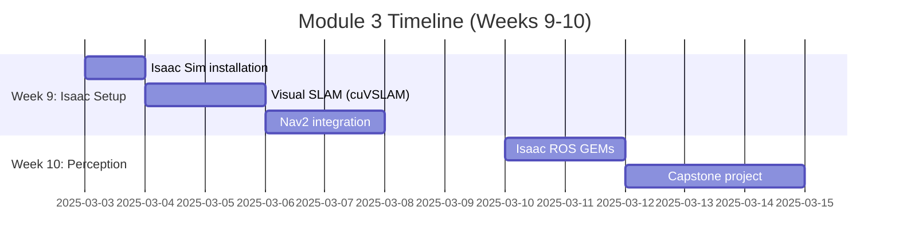

# Module 3: NVIDIA Isaac Sim - Photorealistic Robot Perception

**From simulation to reality—pixel-perfect.**

## Why Isaac Sim?

Gazebo taught you physics simulation. Isaac Sim teaches your robot to **see**.

**Key advantages**:
- **Photorealistic rendering**: RTX path tracing produces training data indistinguishable from real cameras
- **GPU acceleration**: Sensor processing 10-100× faster than CPU-based simulators
- **Domain randomization**: Randomize lighting, textures, physics → robust perception models
- **Isaac ROS GEMs**: Pre-optimized perception nodes (VSLAM, object detection, pose estimation)
- **Omniverse ecosystem**: Import assets from Blender, Unreal, Unity

**When to use Isaac over Gazebo**:
- Vision-based tasks (object detection, VSLAM, semantic segmentation)
- Large-scale training (RL, imitation learning)
- Hardware-in-the-loop with real sensors
- Synthetic dataset generation for ML

## Module Structure (2 Weeks)

### Week 9: Foundations
1. **Isaac Sim Setup**: Install Omniverse, configure Isaac Sim 2023.1+, verify GPU drivers
2. **Visual SLAM**: cuVSLAM with stereo cameras, trajectory visualization
3. **Nav2 Navigation**: Integrate ROS 2 Nav2 stack with costmaps and path planning

### Week 10: Advanced Perception
4. **Isaac ROS GEMs**: DNN inference, AprilTag detection, pose estimation
5. **Capstone Project**: Autonomous warehouse navigation with obstacle avoidance

## Learning Outcomes

By the end of this module:
- Launch Isaac Sim with custom humanoid robot
- Implement visual SLAM for localization (no LiDAR required)
- Configure Nav2 for autonomous navigation
- Use Isaac ROS nodes for GPU-accelerated perception
- Generate synthetic training datasets

## Prerequisites

**Hardware**:
- **GPU**: NVIDIA RTX 2070 or better (8GB+ VRAM)
- **RAM**: 32GB recommended
- **Storage**: 50GB for Isaac Sim + Omniverse

**Software**:
- Ubuntu 22.04 (native or dual-boot recommended; WSL2 works but slower)
- ROS 2 Humble
- NVIDIA drivers 525+
- Docker (for Isaac ROS containers)

**Skills from previous modules**:
- URDF robot modeling (Module 1)
- Gazebo simulation basics (Module 2)
- ROS 2 topics, services, launch files

## Isaac Sim vs. Gazebo

| Feature | Gazebo Classic | Isaac Sim |
|---------|---------------|-----------|
| **Rendering** | OGRE (rasterization) | RTX path tracing |
| **Physics** | ODE/Bullet | PhysX 5 (GPU-accelerated) |
| **Sensors** | CPU-based | GPU-accelerated |
| **Camera realism** | Basic | Photorealistic (lens distortion, motion blur) |
| **Performance** | 10-30 FPS (complex scenes) | 60+ FPS (RTX GPU) |
| **ML integration** | Manual (Python wrappers) | Native (synthetic data API, domain randomization) |
| **Asset ecosystem** | Limited (SDF models) | Omniverse (USD, Blender, Maya, etc.) |
| **Learning curve** | Moderate | Steep (USD, Omniverse Nucleus) |
| **License** | Apache 2.0 (free) | Free for research/education |

**Use both**: Gazebo for rapid prototyping, Isaac Sim for vision and production-grade simulations.

## Common Challenges

**"Isaac Sim won't launch"**:
- Check GPU drivers: `nvidia-smi` (needs 525+)
- Verify Vulkan: `vulkaninfo | grep deviceName`
- Use headless mode on servers: `--/app/window/width=0`

**"ROS 2 bridge not connecting"**:
- Ensure Isaac ROS container is running
- Check ROS_DOMAIN_ID matches
- Verify network: `ros2 topic list` should show Isaac topics

**"Poor performance"**:
- Reduce viewport resolution
- Disable RTX path tracing: Edit → Preferences → Rendering → Use Fast Approximation
- Use GPU-accelerated sensors (replace CPU-based camera plugins)

## Tools You'll Use

- **Isaac Sim 2023.1+**: Main simulation environment
- **Omniverse Nucleus**: Asset server for shared content
- **Isaac ROS**: GPU-accelerated perception nodes
- **cuVSLAM**: NVIDIA's visual SLAM library
- **Nav2**: ROS 2 navigation stack
- **RViz2**: Visualize SLAM maps and paths

## Real-World Impact

**Boston Dynamics (Atlas)**: Trains perception models in Isaac Sim before deploying to hardware.

**Agility Robotics (Digit)**: Uses synthetic data from Isaac for bin-picking computer vision.

**NVIDIA Research**: Generates 100,000+ annotated images/day for training humanoid manipulation policies.

## Module Mindset

> **"Simulation fidelity determines reality performance."**
>
> In Gazebo, a white box is a white box. In Isaac, a white box can have scratches, reflections, dust—**details that make or break vision systems**. Train in high-fidelity simulation, deploy confidently in the real world.

## What's Next?

**Week 9**: Install Isaac Sim, get stereo cameras working, implement visual SLAM.

**Week 10**: Add perception layers (object detection, pose estimation), build warehouse navigation demo.

**Module 4**: Connect vision language actions (VLAs) for language-driven humanoid control ("pick up the red box").

**Ready?** Start with [Isaac Sim Setup](/docs/module-03-isaac/isaac-sim-setup).
