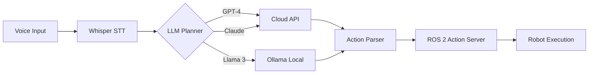
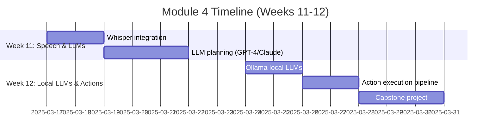

# Module 4: Vision-Language-Action (VLA) Integration

**"Go to the kitchen and bring me a cup."** — Your robot understands natural language.

## What is VLA?

**Vision-Language-Action** models connect human language to robot actions:
- **Vision**: Robot perceives environment (cameras, sensors)
- **Language**: LLM interprets user commands ("pick up the red box")
- **Action**: Robot executes motion primitives (navigate, grasp, place)

**Why VLA matters**: Traditional robot programming requires explicit code for every task. VLAs enable **zero-shot generalization**: describe what you want, the robot figures out how.

## VLA Pipeline Architecture



**Flow**:
1. **Speech-to-Text**: Whisper transcribes voice → text
2. **LLM Planning**: LLM generates structured action plan (JSON)
3. **Action Execution**: ROS 2 nodes execute motion primitives
4. **Feedback Loop**: Robot status updates LLM for replanning

## Module Structure (2 Weeks)



### Week 11: Foundations
1. **Whisper Integration**: Real-time speech transcription with OpenAI Whisper
2. **LLM Planning**: Prompt engineering for robotics with GPT-4 and Claude APIs

### Week 12: Advanced Topics
3. **Ollama Local LLMs**: Run Llama 3/Mistral locally for privacy and low latency
4. **Action Execution**: Parse LLM output → ROS 2 actions (navigation, manipulation)
5. **Capstone Project**: Voice-controlled object retrieval demo

## Learning Outcomes

By the end of this module:
- Integrate OpenAI Whisper for real-time voice transcription
- Design robotics prompts for LLMs (GPT-4, Claude, Ollama)
- Implement multi-provider LLM adapter pattern
- Parse structured LLM outputs (JSON) into ROS 2 actions
- Build end-to-end voice → navigation → manipulation pipeline

## Prerequisites

**Hardware**:
- Microphone (USB or laptop built-in)
- GPU with 8GB+ VRAM (for local Whisper/LLMs)

**Software**:
- Python 3.10+
- ROS 2 Humble (from Module 1)
- Isaac Sim (from Module 3) or Gazebo (Module 2)

**Accounts** (choose one or more):
- OpenAI API key (GPT-4)
- Anthropic API key (Claude)
- Ollama (local, free)

**Skills from previous modules**:
- ROS 2 action servers (Module 1)
- Navigation with Nav2 (Module 3)
- Sensor integration (Module 2-3)

## Multi-Provider LLM Pattern

**Why support multiple LLMs?**
- **Cost**: Cloud APIs ($0.01-0.10 per request), Ollama is free
- **Privacy**: Sensitive commands stay on-device with Ollama
- **Reliability**: Fallback if one provider has outages
- **Performance**: GPT-4 is smarter, Llama 3 is faster

**Adapter pattern**:
```python
class LLMAdapter(ABC):
    @abstractmethod
    def plan_action(self, user_command: str) -> dict:
        pass

class GPT4Adapter(LLMAdapter):
    def plan_action(self, user_command: str) -> dict:
        response = openai.ChatCompletion.create(...)
        return parse_json(response)

class OllamaAdapter(LLMAdapter):
    def plan_action(self, user_command: str) -> dict:
        response = requests.post("http://localhost:11434/api/generate", ...)
        return parse_json(response)
```

**Usage**:
```python
# Swap providers without changing pipeline code
planner = GPT4Adapter()  # or OllamaAdapter(), ClaudeAdapter()
action = planner.plan_action("Go to the kitchen")
execute_action(action)
```

## VLA vs. Traditional Programming

| Approach | Command | Implementation |
|----------|---------|----------------|
| **Traditional** | "Navigate to (2.0, 3.5)" | Hardcoded coordinates in launch file |
| **VLA (Basic)** | "Go to the kitchen" | LLM maps "kitchen" → (2.0, 3.5) from semantic map |
| **VLA (Advanced)** | "Bring me a cup from the table" | LLM chains: navigate → detect cup → grasp → return |

**Key insight**: VLA enables **semantic commands** without explicit coordinate programming.

## Common Challenges

**"LLM returns invalid JSON"**:
- Use structured outputs (OpenAI function calling, Anthropic tool use)
- Add JSON schema validation before execution

**"Whisper transcription has lag"**:
- Use `whisper-jax` (2× faster on GPU)
- Stream audio in 3-second chunks instead of full sentences

**"Robot executes wrong action"**:
- Improve prompt with few-shot examples
- Add confirmation step: "Did you mean: navigate to kitchen? (yes/no)"

**"Ollama runs out of memory"**:
- Use quantized models (Q4_K_M instead of fp16)
- Reduce context length to 2048 tokens

## Tools You'll Use

- **OpenAI Whisper**: Speech-to-text (CPU/GPU versions)
- **OpenAI GPT-4**: Cloud LLM for planning
- **Anthropic Claude**: Alternative cloud LLM
- **Ollama**: Local LLM runtime (Llama 3, Mistral, Phi-3)
- **ROS 2 Action Servers**: Navigate, pick, place primitives
- **Isaac Sim / Gazebo**: Testing environment

## Real-World Impact

**Figure AI (Figure 01 humanoid)**: Uses VLAs for natural language task execution ("make me coffee").

**Boston Dynamics (Spot)**: Integrates GPT-4 for complex inspection tasks via voice commands.

**Tesla Optimus**: Trains manipulation policies from language-annotated demonstrations.

## Module Mindset

> **"Language is the ultimate user interface."**
>
> Instead of learning robot programming, operators speak naturally. VLAs democratize robotics by removing the code barrier—but introduce new challenges: robustness, safety, and handling ambiguous commands.

## Cost Considerations

**Cloud API pricing** (per 1,000 requests):
- GPT-4: $30 (input) + $60 (output)
- Claude Sonnet: $3 (input) + $15 (output)
- Ollama: $0 (local GPU compute only)

**Recommendation**: Prototype with GPT-4 for best results, then optimize with Ollama for production.

## What's Next?

**Week 11**: Integrate Whisper, design robotics prompts for GPT-4/Claude.

**Week 12**: Deploy Ollama locally, build voice-controlled object retrieval system.

**Capstone (Module 5)**: Combine Modules 1-4 into autonomous humanoid demo.

**Ready?** Start with [Whisper Integration](/docs/module-04-vla/whisper-integration).
